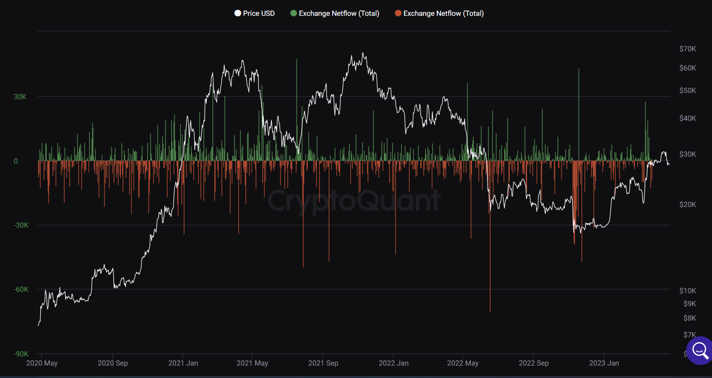

# Polkadot Parachain Netflows until March 2023

A [Polkalytics](https://www.polkalytics.io/) study by Tommi Enenkel (Alice und Bob), [Twitter](https://twitter.com/alice_und_bob), [LinkedIn](https://www.linkedin.com/in/tommi-enenkel/)

# Abstract

This report covers Polkadot & Kusama parachain netflows until March 2023. It will first introduce the concept of exchange netflows and extend the concept to parachain netflows. It will then present visuals of Polkadot and Kusama parachain netflows from the launch of parachains until March 2023 and highlight some insights.

Notably, we observe the occurrence of spikes in strong inflows, closely followed by outflows of the same amount. Polkadot parachains tend to be conservative and have very low volatility in netflows, with the exception of Moonbeam. Kusama parachains are more chaotic with higher volatility and more frequently changing ranks.

The report is accompanied by the source code to produce the visuals and the dataset to produce them, as well as an outlook for possible future work. 

# Whare are Exchange Netflows?

Exchange netflows are a quantitative indicator that refers to the difference between the inflow and outflow of a specific cryptocurrency on an exchange platform. In other words, it is the net amount of a cryptocurrency that is being deposited or withdrawn from an exchange over a given period of time.

Bitcoin Exchange Netflows from CryptoQuant.com, April 2023

When a large number of tokens are deposited into an exchange, this suggests that there may be an increase in selling pressure, as more people are preparing to sell their tokens. Conversely, when a large number of tokens are withdrawn from an exchange, it implies that more people are taking their tokens off the market, possibly indicating an increase in demand or a decrease in selling pressure.

Analyzing exchange netflows can provide valuable insights into the market sentiment and potential price movements of a cryptocurrency. If the netflow is positive (more inflows than outflows), it might be a bearish signal, suggesting that tokens are moved to an exchange to sell them. If the netflow is negative (more outflows than inflows), it might be a bullish signal, suggesting that tokens have been acquired and are moving to on-chain wallets.

# Parachain Netflows

This analysis started out with the question of how DOT and KSM are moving between Polkadot and Kusama parachains. Visualizing netflows can answer several **questions**:

- Are tokens flowing into or out of parachains?
- How do parachains compare to each other in utilizing large amounts of DOT?
- Are there any common trends?

### Method

To perform the analysis, a full history of balance changes of the parachain sovereign accounts was taken, capturing every single point in time the DOT balance of a parachain changed.

Capturing the full history of balance changes allows for the highest possible granularity of netflows and ensures that even short-lived deposits are captured in the analysis.

- More details on capturing the data…
    - The list of sovereign account addresses was captured by manually grabbing them from the Subscan Parachains screen. The final lists can be found here: [Polkadot](https://github.com/Polkalytics/parachain-netflows/blob/main/data/in/polkadot_labels.csv), [Kusama](https://github.com/Polkalytics/parachain-netflows/blob/main/data/in/kusama_labels.csv)
    - Capturing balance changes is not possible by looking at historic extrinsics and events alone, thus the change of balances must be determined by querying system.account
    - Since the moments in time when balance changes occur are unknown, the basic approach is to perform a binary search against the RPC on the state of the account balance. To speed up the search, a few optimizations can be performed:
        - Keep previously queried results from the binary search in a map to aid future queries
        - create a list of likely/certain balance changes from extrinsics that the account performed or were performed by proxy, as well as events that happened to the account
    - to cross-reference against the time, and query the timestamp.set extrinsic at the start of the block

<aside>
💡 Polkadot makes use of reserve-backed transfers, where DOT is sent to a dedicated parachain account (the “sovereign account”) of a parachain on Polkadot and is then minted on the parachain.

</aside>

## Notes/Disclaimers

- You can find the source code to produce the visuals in this Polkalytics Github repo: https://github.com/Polkalytics/parachain-netflows
- **On the term “Netflows”:** Strictly speaking, this report doesn’t cover netflows in the original meaning but rather balances over time. But because the visualization can highlight the same trends and more, we will still refer to the type of visualization as netflows.
- **Liquid staking:** Some chains like Acala, Parallel, Bifrost, and Moonbeam host liquid staking protocols. It is possible that those protocols control more DOT/KSM than is shown in the charts below, as only sovereign accounts have been measured.
- **Full Disclosure:** The author has a contractual relationship with Mangata Finance.

## Polkadot Netflows

DOT Balance over Time on Polkadot

This chart presents DOT balances over time on Polkadot for different parachains with a balance of at least 10_000 DOT at the time of the last snapshot.

- **Acala** pioneered XCM transfers in February 2022 and has been keeping a steady balance of 1.5m - 2m DOT since May 2022.
- **Moonbeam** has seen a strong rise and fall in its DOT balance. From May 2022 until November 2022 it rose to 3.5m DOT. Since then, the balance has fallen under 1m DOT.
- **Parallel** kept third place for most of its run, with the balance ranging between 0.5m - 1.5m DOT.
- **Interlay** is also fairly steady with 0.5m - 1m DOT.
- **Astar** has seen a strong rise to 1m DOT and has since seen its balance converge to about 0.2m DOT.
- **Bifrost** and **Equilibrium** are in the 100k DOT range.

A few observations:

- Overall, most chains picked a lane and remained there with low volatility, with the exception of Moonbeam.
- **Spikes:** A few spikes can be observed on Acala, Moonbeam, and Parallel, with Acala having the most and most intense ones.
    - In May 2022, we can observe the inflow and immediate outflow of 2.5m DOT on Acala. There are also single occurrences of 2m, 1.5m, and 1m DOT spikes.
    - In March 2023, the 1.5m DOT Acala spike coincides with spikes on Moonbeam and Parallel.

## Kusama Netflows

KSM Balance over Time on Kusama

This chart presents KSM balances over time on Kusama for different parachains with a balance of at least 1_000 KSM at the time of the last snapshot.

- **Moonriver** is in the lead. After having reached a peak of 160k KSM in November 2022, it is ranging down and currently holds at 100k KSM in March 2023.
- **Karura** started with a meteoric rise in July 2021 to close to 170k DOT, then sank to 60k KSM in Mai 2022 and has been ranging between 60k and 80k KSM since then.
- **Bifrost** started with 20k KSM, has seen a peak of 120k KSM, and now generally ranges between 20k and 40k
- **Kintsugi** has seen a steady growth to almost 60k KSM and has since seen two big withdrawals, setting it to 20k KSM.
- **Heiko** shows a similar pattern to Bifrost, but at a somewhat lower magnitude, generally ranging between 15k and 30k KSM.
- **Mangata** started into the 12k KSM region and has remained fairly constant.
- **Basilisk** and **Picasso** range at 5k and 3k KSM respectively.

A few observations:

- Generally, we see more volatility and a closer field between Kusama parachains than Polkadot parachains.
- Spikes are also much more common, with Bifrost and Heiko being the most visible ones.

# Summary

In summary, we observe:

- Polkadot parachains tend to be conservative and have very low volatility in netflows, with the exception of Moonbeam.
- Kusama parachains are more chaotic with higher volatility and more frequently changing ranks.
- The occurrence of spikes: Sudden, strong inflows, closely followed by outflows of the same amount.

## Interpretation of Spikes

It is not possible to conclusively pinpoint the story behind the spikes. A possible explanation is that liquid staking protocols are moving tokens that have been transferred to the parachain to dedicated staking accounts, which would not immediately be visible here. Another possibility might be that OTC deals were facilitated on those chains. The analysis of that might be an interesting piece of future work.

## Go with the Flow

If you enjoyed this report, make sure to follow our socials for more Polkadot on-chain insights:

- Twitter: [Polkalytics](https://twitter.com/Polkalytics) and [Alice und Bob](https://twitter.com/alice_und_bob)
- [YouTube](https://www.youtube.com/@alice_und_bob)
- Subscribe to the Newsletter on our Website [polkalytics.io](https://www.polkalytics.io/)
- Fork the Github Repository to create the visuals: https://github.com/Polkalytics/parachain-netflows

If you need custom reporting or consulting, you can [book a free call with Polkylatics](https://cal.com/tommi-enenkel/polkalytics?duration=30).